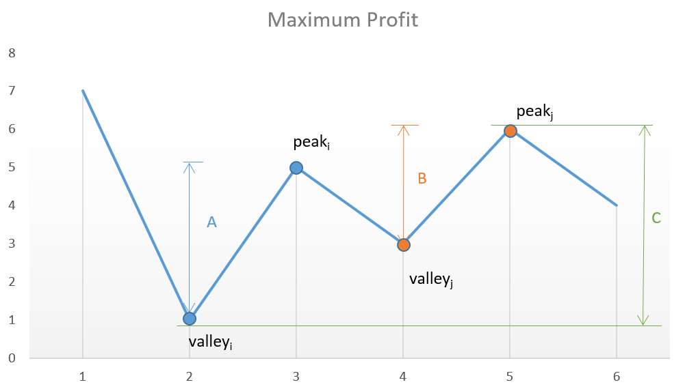

# 122. 买卖股票的最佳时机 II
##### 难度: 简单

## 题目描述

给定一个数组，它的第 i 个元素是一支给定股票第 i 天的价格。

设计一个算法来计算你所能获取的最大利润。你可以尽可能地完成更多的交易（多次买卖一支股票）。

注意：你不能同时参与多笔交易（你必须在再次购买前出售掉之前的股票）。

## 示例

输入: [7,1,5,3,6,4]

输出: 7

解释: 在第 2 天（股票价格 = 1）的时候买入，在第 3 天（股票价格 = 5）的时候卖出, 这笔交易所能获得利润 = 5-1= 4 。
     随后，在第 4 天（股票价格 = 3）的时候买入，在第 5 天（股票价格 = 6）的时候卖出, 这笔交易所能获得利润 =6-3=3。

## 解析

**主要思路**

要想获得最大盈利,必须以最低的价格买入,最高的价格卖出.


- 暴力法

  遍历给定的数组,得到相邻两天之间的差值,若差值大于零,则可以完成交易,即获取盈利.
  
  利润则为所有大于零的差值的总和.
  
  根据下图,可以看出,每天的股票价格是有波动的.而要想获取利润,只能在曲线的上升部分抛售,即相邻两天的差值大于零.
  
  
                                    图片来自LeetCode官方题解
                
  
  ```python     
  class Solution(object):
    def maxProfit(self, prices):
        """
        :type prices: List[int]
        :rtype: int
        """
        profit = 0
        for i in range(len(prices)-1):
            diff = prices[i+1] - prices[i]
            if diff > 0:
                profit += diff
        return profit
  ```
  
  
  ```c++
  class Solution{
    public:
    int maxProfit(vector<int>& prices){
        int profit = 0;
        for(int i = 1; i < prices.size(); i++){
            if(prices[i] > prices[i-1]){
                profit += (prices[i] - prices[i-1]);
            }
        }
        return profit;
    }
  };
  ```

## 传送门

来源：[力扣（LeetCode）](https://leetcode-cn.com/problems/best-time-to-buy-and-sell-stock-ii)
著作权归领扣网络所有。商业转载请联系官方授权，非商业转载请注明出处。
